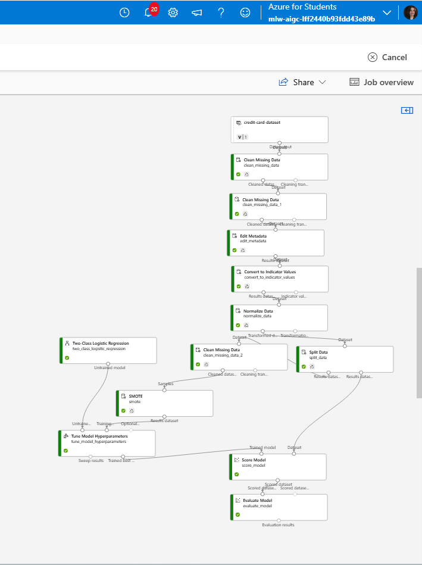
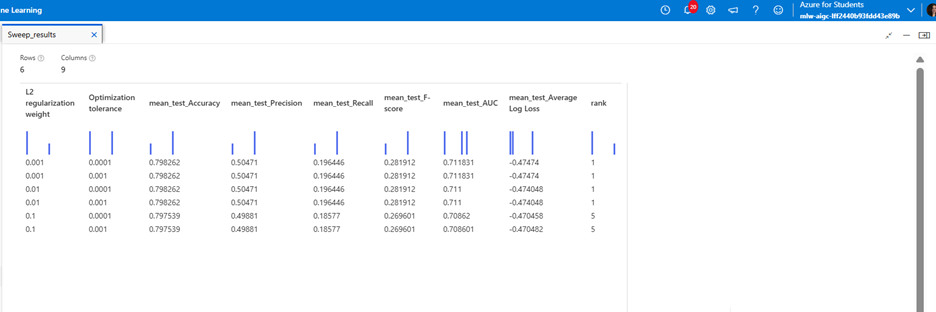
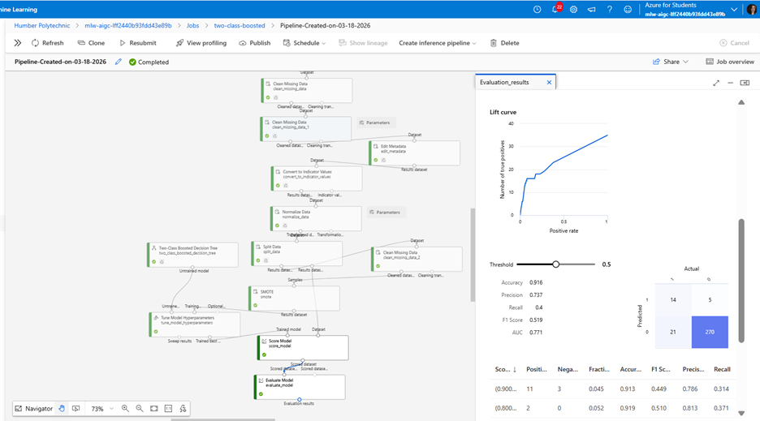

# Credit Card Risk Classification

**Author:** Haneen Altaie  
**Program:** AI Integration and Governance, Humber College  

This project is a machine learning classification workflow developed using Microsoft Azure Machine Learning Designer to predict credit card risk. The main focus of the project was to explore how class imbalance affects classification performance and how techniques such as SMOTE and hyperparameter tuning can improve model results.

---

## Project Objective

The objective of this project was to build and evaluate a binary classification model that predicts credit card risk using customer and financial data.

The project also aimed to compare model performance before and after handling class imbalance, while observing how tuning Logistic Regression parameters affects predictive results.

---

## Problem Statement

In credit risk prediction, class imbalance is a major challenge because high-risk cases are often much less frequent than low-risk cases. This can make a model appear accurate while still performing poorly on the minority class.

This project demonstrates why evaluation metrics such as **Recall** and **F1-score** are often more meaningful than accuracy in imbalanced classification problems.

---

## Tools and Technologies

- Microsoft Azure Machine Learning Designer
- Two-Class Logistic Regression
- SMOTE (Synthetic Minority Oversampling Technique)
- Hyperparameter Tuning
- Classification Evaluation Metrics

---

## Workflow Overview

The project workflow included the following stages:

1. Data preprocessing  
2. Handling missing values  
3. Encoding categorical variables  
4. Training a Two-Class Logistic Regression model  
5. Hyperparameter tuning  
6. Applying SMOTE to address class imbalance  
7. Evaluating model performance before and after balancing  

---

## Preprocessing Steps

Before modeling, the dataset was prepared through several preprocessing steps:

- Missing values were handled using **Clean Missing Data**
- Categorical variables were encoded using **Convert to Indicator Values**
- Additional cleaning was applied after encoding to ensure model-ready input

These steps helped convert the raw data into a format suitable for machine learning.

---

## Modeling Approach

The main classification model used in this project was:

### **Two-Class Logistic Regression**

The model was trained and evaluated both **before** and **after** applying **SMOTE**.

Hyperparameter tuning focused on:

- **L2 Regularization (λ)**
- **Optimization Tolerance**

These parameters helped control model complexity and convergence behavior.

---

## Results Summary

The initial Logistic Regression model achieved relatively high accuracy, but poor Recall and F1-score. This showed that the model was not effectively identifying the minority class.

After applying **SMOTE**, the model became more balanced and improved its ability to detect high-risk cases.

### Performance Comparison

| Metric | Before SMOTE (Training) | Before SMOTE (Testing) | After SMOTE (Training) | After SMOTE (Testing) |
|--------|--------------------------|-------------------------|-------------------------|------------------------|
| Accuracy | 0.889 | 0.894 | 0.798 | 0.871 |
| Precision | 0.571 | 0.667 | 0.505 | 0.353 |
| Recall | 0.065 | 0.114 | 0.196 | 0.171 |
| F1 Score | 0.115 | 0.195 | 0.282 | 0.231 |
| AUC | 0.634 | 0.618 | 0.711 | 0.588 |

---

## Key Findings

- Accuracy alone was misleading for this dataset
- The original model struggled with the minority class
- Applying **SMOTE** improved Recall and F1-score
- Logistic Regression still had limitations on this dataset
- A more advanced model such as **Boosted Decision Tree** performed better, reaching:
  - **F1-score = 0.519**
  - **Recall = 0.4**

This suggests the dataset contains more complex patterns than Logistic Regression can fully capture.

---

## Screenshots

### Azure ML Workflow with SMOTE

### Hyperparameter Tuning / Metrics After SMOTE

### Final Model Results

---

## Files Included

- `lab-07-hpo.pdf` → final project report
- `workflow-overview-SMOT.png` → Azure ML workflow including SMOTE
- `metrics-comparison-SMOT2.png` → tuned model metrics after SMOTE
- `model-results.png` → final model evaluation and boosted decision tree result

---

## Learning Outcomes

Through this project, I practiced:

- classification modeling
- handling imbalanced datasets
- applying SMOTE
- evaluating model performance using multiple metrics
- hyperparameter tuning in Azure ML
- interpreting underfitting and model limitations

---

## Conclusion

This project highlights the importance of choosing the right evaluation metrics when working with imbalanced classification problems.

Although Logistic Regression improved after applying SMOTE and tuning its parameters, the results showed that more advanced models may be better suited for this type of problem.

Overall, this project demonstrates a practical machine learning workflow for credit risk classification and model evaluation.
